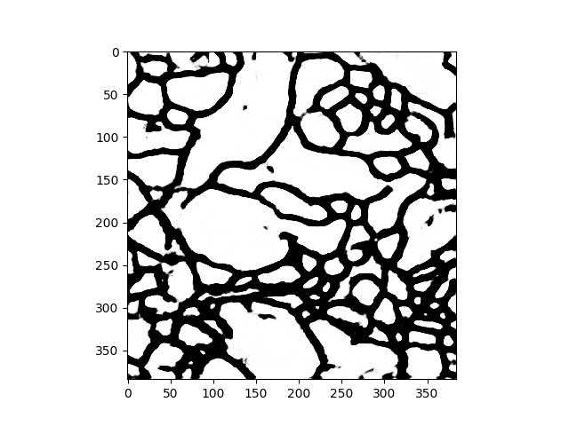

# U-Net with advanced encoder and decoder

## Task

We are tasked to provide the segmentation of cell boundaries within mouse brain by training a model on the dataset including fruit fly brain image.

(to do) : insert images of origibal and segmentation mask

## Data

In this model, we trained on fruit fly images and mouse brain images found online and validated the model on the provided mouse brain images and masks to select the model and evaluate the performace of this model based in IOU metric, which is defined as 

\begin{equation}
true positive / (true positive + false positive + false negative)
\end{equation}

 
### training 

* fruit fly image and segmentation mask pair
#### data augmentation

In order to generalize better, we applied data augmentation techniques, which are proven to be effective on biomedical image data.

* random elastic deformation
* random shear (rotation, shifting and scaling)
* random contrast and brightness change
* flip

Then, in order not to have blank space as a result of these transformation, we radomly cropped the images to 256 x 256.

### test and validation 
* mouse brain image

## Model

As a baseline model, we adopted U-Net, which is characterized with encoder and decoder architecture, because this model is proven to be work well with biological images. 
The Intersection of Union metric was used to evaluate performance.

In order to improve the performance we incorporated couple of changes below.

* Modified the encoder to Deep Residual Pyramid Net
* incorporated spatial and channelwise squeeze and excitation block
* optional: shakedrop regularization technique to see if it generalizes well

## Result

The provided fruit fly data doesn't allow for effective generalization to the mouse data with this model. This was verified by training the model with different percentages of the mouse used as training data (and not used as validation data). Results including randomly selected samples can be seen below.

Only fruit fly data:

Best IOU: 70%

20% mouse data:

Best IOU: 82%

40% mouse data:

Best IOU: 83%

## Discussion

### relatively poor performance on test set
While we have 

### Shakedrop

## Conclusion and future direction
